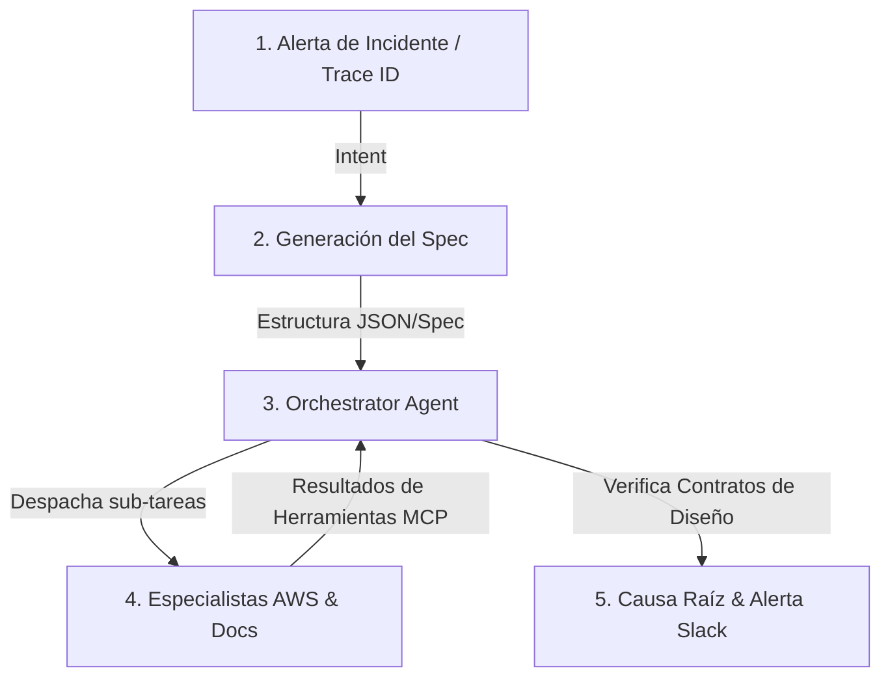
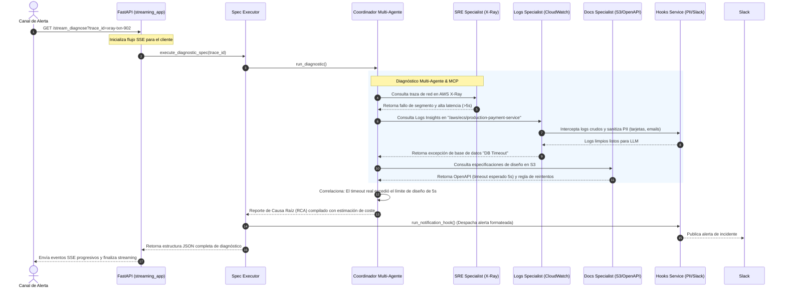

# KIRO AWS Observability Agent: Spec-Driven Multi-Agent Diagnostics

Este documento contiene la **Especificación Técnica y Arquitectura de Presentación (Spec-Driven Design Blueprint)** para el Agente Inteligente de Observabilidad y Análisis de Logs Multi-Microservicio integrado en AWS y construido bajo los principios conceptuales del framework **KIRO**.

---

## 1. El Concepto: Spec-Driven Development en KIRO

En el framework **KIRO**, un agente no opera de forma puramente reactiva u ad-hoc; en su lugar, se rige bajo el paradigma de **Desarrollo Guiado por Especificaciones (Spec-Driven Development)**. 



Este enfoque estructurado se desglosa en tres etapas:
1.  **Intent (Intención):** Captura del síntoma inicial, gatillado por una alerta de CloudWatch, un webhook o un Trace ID específico de AWS X-Ray.
2.  **Plan (Especificación):** Creación de un documento de especificación técnica dinámico (en formato JSON estructurado) que delimita el alcance de la investigación, los microservicios involucrados, los log groups a consultar y las políticas de coste máximas toleradas.
3.  **Run (Ejecución):** El sistema multi-agente ejecuta de manera determinista cada paso del Spec utilizando herramientas del protocolo MCP, garantizando la predictibilidad y el cumplimiento de las restricciones operativas.

---

## 2. Arquitectura de Componentes del MVP

El MVP implementado demuestra una separación rigurosa de responsabilidades (Separation of Concerns) alineada con los **5 Pilares de KIRO**:

```
template_Agent/
├── Docs/
│   └── KIRO_SPEC_PRESENTATION.md # Este documento de especificación
├── kiro_agent/
│   └── main.py             # API FastAPI base ultra-básica (Punto de inicio para tu lógica)
├── Makefile                # Automatización de tareas de desarrollo (make install, make dev)
└── Dockerfile              # Empaquetado multietapa optimizado para producción
```

---

## 3. Matriz de Agentes Especializados y Prompts

El sistema coordina a **cuatro agentes autónomos** independientes, cada uno gobernado por una plantilla de prompt de ingeniería específica ubicada en `prompts.py`:

| Nombre del Agente | Rol en la Presentación | Prompt Gobernador (`prompts.py`) | Entrada Esperada | Herramientas Utilizadas |
| :--- | :--- | :--- | :--- | :--- |
| **Incident Coordinator** | Orquestador General y Correlación | `COORDINATOR_SYSTEM_PROMPT` | Alerta de Entrada o Trace ID | Coordina sub-agentes asíncronamente |
| **Logs Specialist** | Analista de CloudWatch Insights | `LOGS_SPECIALIST_SYSTEM_PROMPT` | Mapeo de Log Groups de AWS | `query_logs_insights()` |
| **SRE Specialist** | Analista de Topologías X-Ray | `SRE_SPECIALIST_SYSTEM_PROMPT` | Trace ID (UUID) | `get_trace_summaries()` |
| **Docs Specialist** | Auditor de Contratos en S3 (RAG) | `DOCS_SPECIALIST_SYSTEM_PROMPT` | Nombre del Servicio y Endpoint | `get_openapi_spec()`, `retrieve_architecture_context()` |

---

## 4. Flujo de Diagnóstico de un Incidente Real (Caso de Demostración)

Durante la presentación del MVP, puedes simular un incidente típico de producción: **Fallo en Checkout por Timeout de Pago**.



---

## 5. Gobierno y Seguridad (Las "Joyas de la Corona" del MVP)

Estas dos funcionalidades avanzadas representan el valor de grado empresarial (*Staff Engineer level*) del proyecto para asombrar a los evaluadores:

### A. Hard Cost Guardrail (Pilar 1: STEERING)
*   **El Problema:** Un agente con llamadas en bucle infinito consultando APIs de LLM puede consumir miles de dólares en minutos.
*   **La Solución KIRO:** La clase `KiroSteeringGuard` acumula activamente el conteo de consultas a AWS CloudWatch y el costo financiero estimado de Bedrock en tiempo real por cada sesión. Si la sesión supera el umbral límite configurado en `.env` (ej. `$2.50 USD`), interrumpe inmediatamente la ejecución lanzando un `RuntimeError` controlado, protegiendo el presupuesto.

### B. Enterprise PII Sanitizer (Pilar 2: HOOKS)
*   **El Problema:** Enviar logs de CloudWatch que contienen datos personales de clientes (emails, Bearer tokens, números de tarjetas de crédito) a un LLM viola normativas de cumplimiento como PCI-DSS, GDPR o leyes locales de protección de datos.
*   **La Solución KIRO:** El método `run_sanitization_hook` intercepta el flujo de logs en tiempo real, aplicando expresiones regulares compiladas de alto rendimiento que enmascaran automáticamente todo dato sensible antes de ser procesado por la inteligencia artificial.

---

## 6. Guía de Ejecución de la Demostración (Live Demo Script)

Sigue estos sencillos pasos para lucirte en la presentación del MVP:

### Paso 1: Instalación del Entorno
Inicia la instalación de dependencias en un entorno aislado de Python de manera automática:
```bash
make install
```

### Paso 2: Ejecutar los Tests Unitarios (Demostración de Rigor Técnico)
Muestra cómo tu suite de pruebas valida la lógica del agente de forma local sin requerir credenciales AWS activas (gracias a los mocks):
```bash
make test
```
*Se observará el paso de los 3 tests:* `test_health_endpoint`, `test_pii_sanitization_hook` y `test_steering_limits_exceeded`.

### Paso 3: Lanzar el Servidor en Vivo
Inicia la API asíncrona de desarrollo local:
```bash
make dev
```
El servidor se levantará en el puerto **`8080`**. Puedes abrir un navegador en [http://localhost:8080/health](http://localhost:8080/health) para ver que responde el motor KIRO saludablemente.

### Paso 4: Probar el Diagnóstico REST Tradicional
Envía una petición de diagnóstico para un ID de traza de AWS X-Ray:
*   **Método:** `POST`
*   **URL:** `http://localhost:8080/diagnose?trace_id=1-5f3e2e4a-1234567890abcdef12345678`
*   *Retornará la estructura JSON completa de la causa raíz, los agentes desplegados, sus prompts específicos y la evaluación de costos.*

### Paso 5: Probar el Diagnóstico Progresivo (Streaming SSE)
Abre un navegador en la siguiente dirección para visualizar cómo el agente envía la información en tiempo real paso a paso (ideal para alimentar interfaces de chat dinámicas):
```
http://localhost:8080/stream_diagnose?trace_id=1-5f3e2e4a-1234567890abcdef12345678
```
Verás el streaming progresivo de Server-Sent Events devolviendo el estado de la investigación hasta consolidar el RCA final.
